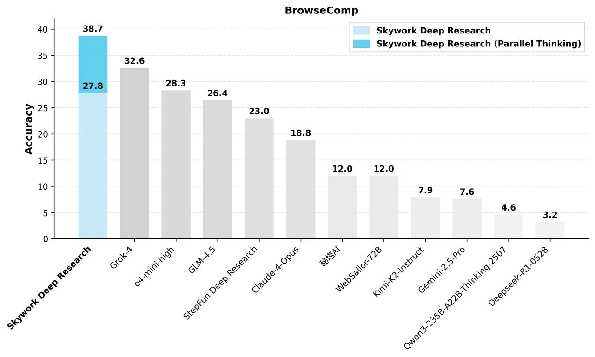

# Skywork-DeepResearch

<div align="center">
  
</div>

## 🔥 Highlights

Skywork-DeepResearch V2 represents a breakthrough in deep research agents, combining a novel data synthesis piepline and an end-to-end reinforcement learning pipeline with cutting-edge techniques for verification and reward shaping. Our approach features:

- **Advanced RL Pipeline**: Non-symmetric verification coupled with dense, clue-aware reward shaping
- **High-Quality Synthetic Data**: Built through a two-stage process that iteratively enhances the quality, diversity, and complexity of the data
- **Efficient Infrastructure**: Parallel inference capabilities and self-learning multi-agent loops enable rapid continual improvement
- **State-of-the-Art Performance**: Sets new benchmarks on demanding web-research tasks, outperforming Claude-4-Opus, GLM-4.5, and other leading systems

Skywork-DeepResearch V2 is now available through API access.

## 📊 Evaluation

Skywork-DeepResearch V2 demonstrates exceptional performance on the [BrowseComp](https://arxiv.org/abs/2504.12516) benchmark, establishing new state-of-the-art results. The following evaluation shows our model significantly outperforming strong baselines including Claude-4-Opus, GLM-4.5, and other leading systems.

With parallel thinking enabled, Skywork-DeepResearch V2 achieves **38.7% accuracy**, surpassing the previous state-of-the-art (Grok-4) by an impressive 6.1 percentage points.



## 📦 API Access and Usage

Skywork-DeepResearch V2 is currently available through API access. To request access, please submit an application to **deepresearch@skywork.ai** with the following information:

- **Affiliated Institution**: Your organization or academic institution
- **Intended Usage**: Detailed description of your use case and research objectives
- **Expected Maximum Concurrent Requests**: Estimated API load requirements
- **Contact Information**: Primary contact details for technical correspondence
- **Additional Requirements**: Any specific needs or constraints for your implementation

Our team will review your application and provide access credentials along with API usage instructions upon approval.

## 📧 Contact

For questions, support, or general inquiries about Skywork-DeepResearch V2, please contact us at **deepresearch@skywork.ai**.

## 📚 Citation

If you find our work helpful or use it in your research, please consider citing:

```bibtex
@misc{skywork2025deepresearch,
  title = {Skywork-DeepResearch},
  author = {Skywork AI},
  howpublished = {\url{https://github.com/SkyworkAI/Skywork-DeepResearch}},
  year = {2025},
}
```